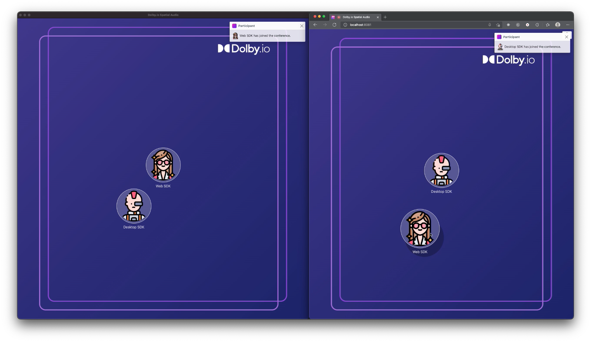

# Communications APIs - Spatial Audio for Web SDK

This sample application allows you to demonstrate how Spatial Audio works.

This is what the application looks like. Everybody can move the participants on their UI and will get a unique spatial audio scene. Moving into the Private zone will isolate your from other participants. This is handled using the [SDK extensions](https://github.com/DolbyIO/comms-sdk-web-extensions) available on GitHub.

## Open Source Projects

This sample application is using the following Open Source projects:
- [Bootstrap](https://getbootstrap.com)
- [JsRender](https://www.jsviews.com/)
- [JQuery](https://jquery.com)
- [JQuery UI Touch Punch](https://github.com/furf/jquery-ui-touch-punch)
- [Express](https://expressjs.com/)
- [Dolby.io SDK extensions](https://github.com/DolbyIO/comms-sdk-web-extensions)

## Avatar images

The avatar images are made by [photo3idea_studio](https://www.flaticon.com/authors/photo3idea-studio), [Freepik](https://www.freepik.com), and [Micro icons](https://www.flaticon.com/free-icons/micro) from [www.flaticon.com](https://www.flaticon.com/).
