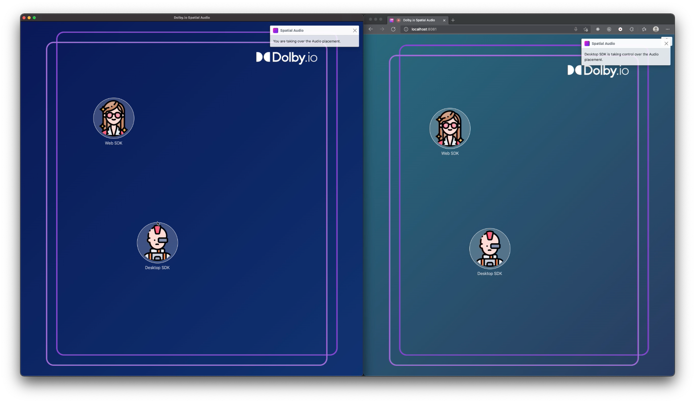

# Communications APIs - Spatial Audio for Web SDK

This sample application allows you to demonstrate how Spatial Audio works. You can run the application on either web or Desktop.

This is what the application looks like side by side. Everybody can move the participants on their UI and will get a unique spatial audio scene.

You can also control the spatial audio scene for other participants. When you have the control over the spatial audio scene, you can move the participants around with a simple drag and drop, then the same movement will be applied on the other participants UI.

## Open Source Projects

This sample application is using the following Open Source projects:
- [Bootstrap](https://getbootstrap.com)
- [JsRender](https://www.jsviews.com/)
- [JQuery](https://jquery.com)
- [JQuery UI Touch Punch](https://github.com/furf/jquery-ui-touch-punch)
- [Express](https://expressjs.com/)

## Avatar images

The avatar images are made by [photo3idea_studio](https://www.flaticon.com/authors/photo3idea-studio), [Freepik](https://www.freepik.com), and [Micro icons](https://www.flaticon.com/free-icons/micro) from [www.flaticon.com](https://www.flaticon.com/).
